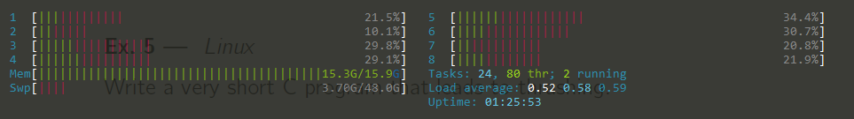
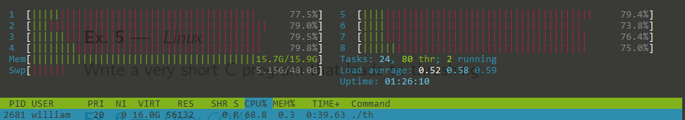

# VE482 Homework 6

<center><div style="width:100%;height:57%;text-align:center;font-size:16px;line-height:25px;font-family: 'Courier New', Courier, monospace;font-weight:300;"><b>Due: Nov.15<br>Name: Wu Qinhang<br>ID: 518370910041<br>Email: william_wu@sjtu.edu.cn</b>
</div></center>

## Ex1 Basic Memory

**Consider a swapping system in which memory consists of the following hole sizes in memory order: 10 KB, 4 KB, 20 KB, 18 KB, 7 KB, 9 KB, 12 KB, and 15 KB. Assuming first fit is used, which hole is taken for successive segment requests of: (i) 12 KB, (ii) 10 KB and (iii) 9KB. Repeat for best fit and quick fit.**

- First Fit: 
  - (I) 20KB
  - (II) 10KB
  - (III) 18KB
- Best Fit: 
  - (I) 12KB
  - (II) 10KB
  - (III) 9KB
- Quick Fit:
  - (I) 12KB
  - (II) 10KB
  - (III) 9KB

**If an instruction takes 10 nsec and a page fault takes an additional n nsec, give a formula for the effective instruction time if page faults occur every k instructions.**

- $10+n/k (nsec)$

**A small computer has four page frames. At the first clock tick, the R bits are 0111. At t subsequent clock tics, the values are 1011, 1010, 1101, 0010, 1010, 1100 and 0001. Assuming the aging algorithm is used with an 8-bit counter what is the value of the four counters after the last tick.**

```c
01101110 // Page 0
01001001 // Page 1
00110111 // Page 2
10001011 // page 3
```

## Ex2 Page Tables[^1]

TLB is not capable of handling large page tables, so two more solutions are introduced:

### Inverted Page Tables

Instead of using one entry of page frame per page of virtual address space, this scheme uses one entry per page frame in the real memory. It can save a lot of space when the virtual address space is much larger than the physical memory (Figure 1). TLB and hash table can be used to solve a relevant dilemma of virtual-to-physical translation.


<center>Figure 1. Traditional Page Table vs. Inverted one (with hash table implementation) [1]</center>

### Multilevel Page Tables

In the scheme of traditional page table, many page tables that are not very necessary to maintain are always kept in the memory. Multilevel Page Tables fix this issue. It is separated into different levels: top-level page table, second-level and so on. It use PT1 to index the virtual address into the top-level field, PT2 to index into the second-level field, and Offset to construct the physical address (Figure 2).

<center></center>

<center>Figure 2. Multilevel Page Tables [1]</center>

## Ex3. Research

### Security Hole[^3] [^4]

Many vulnerabilities in C program are related with buffer overflows and string manipulation. In certain cases, specific input values will not result in segmentation fault, which results in security holes.

The first example is Format-Buffer-Overflow:

```c
#include <stdio.h>
int main(){
  char str[10];
  sprintf(str,"%s","abcdefghijkl"); // buffer overflow
}
```

Since the formatted output is bigger than the buffer size, the program is vulnerable. It may result in an application crash, or in a worse case, information leak. In the worst case, there may be an arbitrary code execution if some elements in the code are capable of being controlled.

The second example is Command-Tainted-Argument:

```c
#include <stdio.h>
#include <unistd.h>
#include <stdlib.h>
int main(){
  char str[60];
  fgets(str,59,stdin);
  system(str); // arbitrary command execution via str
}
```

Since the string `str` is open for input, anyone that is able to access this application can execute any command, so that the whole system is endangered.

### Meltdown and Spectre [^5] [^6] [^7] [^8]

Meltdown and Spectre are two categories of common vulnerabilities in modern computers that may leak personal data which are detected in the late 2017. 

Generally speaking, **Meltdown** "breaks the most fundamental isolation between user applications and the operating system", which allows a user program to access the memory even it was forbidden to do so. **Spectre** "breaks the isolation between different applications", which allows a user program to steal secret data from an application that is error-free.

Meltdown exploits the mechanism of **CPU speculative execution**, which is implemented on several generations of Intel CPU chip. The operating system takes several precautions to prevent user programs to access the memory address in the kernel. They involves virtual memory and certain hardware mechanisms like TLB. Therefore, in normal situation, the user program won't get access to the memory address in the kernel, because it cannot bypass the permission check by CPU. However, CPU speculative execution will help pass the information of the memory address before the permission check mechanism stops the query. Since there exists difference between accessing the data that is cached and not cached, a meltdown security hole is exposed, and a byte can be extracted from the memory address in the kernel.

<center></center>

<center>Figure 3. Exception handling exploited by Meltdown [6] </center>

Since the fundamental vulnerability is from the hardware, there is no patch for it. However, there are several different approaches:

- isolate kernel and user mode page table to isolate kernel memory from user-mode processes
- new CPU instructions that eliminate branch speculation
- introducing a new partitioning system that improves process and privilege-level separation (only available for newer generation of CPU)

## Ex4. Memory in Minix 3 [^2]

Virtual memory related files in Minix 3:

- `servers/vm/main.c` receive calls from Userland and assign tasks to sub-functions
- `servers/vm/region.c` define and manipulate important data structures where high-level data structure such as **Page Table** depends on:
  - Region
  - Physical region
  - Physical block
  - Memory type
  - Cache
- `servers/vm/mem_*.c` describes various memory type
- `servers/vm/mmap.c` call-specific work
- `servers/vm/arch/i386/pagetable.c` update the process page table

<center></center>

<center>Figure 4. demo call structure for allocating memory [2]</center>

The page table is of size **4096** Byte: 

```c
// include/arch/i386/include/vm.h
#define I386_PAGE_SIZE		4096
// servers/vm/arch/i386/pagetable.h
#define VM_PAGE_SIZE	I386_PAGE_SIZE
```

Each page table entry contains

- pointer to virtual memory directory entries
- physical address of the page table directory
- an array of pointers to page tables in the virtual memory address space
- a virtual address that accelerates the search for a hole

```c
// servers/vm/pt.h

/* A pagetable. */
typedef struct {
	/* Directory entries in VM addr space - root of page table.  */
	u32_t *pt_dir;		/* page aligned (ARCH_VM_DIR_ENTRIES) */
	u32_t pt_dir_phys;	/* physical address of pt_dir */

	/* Pointers to page tables in VM address space. */
	u32_t *pt_pt[ARCH_VM_DIR_ENTRIES];

	/* When looking for a hole in virtual address space, start
	 * looking here. This is in linear addresses, i.e.,
	 * not as the process sees it but the position in the page
	 * page table. This is just a hint.
	 */
	u32_t pt_virtop;
} pt_t;
```

Basic functions used to handle virtual memory:

```c
// servers/vm/arch/i386/pagetable.c

static u32_t findhole(int pages); // Find a space in the virtual address space of VM

void vm_freepages(vir_bytes vir, int pages); // Free pages from a virtual memory

void *vm_allocpages(phys_bytes *phys, int reason, int pages); // allocate a page for use by Virtual Memory

void vm_pagelock(void *vir, int lockflag); // mark a page allocated by vm_allocpage() unwritable

int pt_ptalloc_in_range(pt_t *pt, vir_bytes start, vir_bytes end,
	u32_t flags, int verify); // allocate all the page tables in the range specified

int pt_map_in_range(struct vmproc *src_vmp, struct vmproc *dst_vmp,
	vir_bytes start, vir_bytes end); // transfer mappings

int pt_ptmap(struct vmproc *src_vmp, struct vmproc *dst_vmp); // transfer mappings

int pt_writemap(struct vmproc * vmp,
			pt_t *pt,
			vir_bytes v,
			phys_bytes physaddr,
			size_t bytes,
			u32_t flags,
			u32_t writemapflags); // write mapping into page table

int pt_new(pt_t *pt); // allocate a page table root

void pt_init(void); // initialize a page table

int pt_bind(pt_t *pt, struct vmproc *who) // bind a page table
  
void pt_free(pt_t *pt); // free memory associated with this pagetable
```

## Ex5. Thrashing

A demo C program that leads to thrashing:

```c
// Assume that we're using a computer with physical memory of 16 GB, and some programs have already taken 2GB memory.
#include <stdio.h>
#include <stdlib.h>

typedef struct _Big{
  int *d1; // 1,073,741,824 * 4 = 4GB
  int *d2; // 4GB
  int *d3; // 4GB
  int *d4; // 4GB
  int ok1,ok2,ok3;
} Big;

void initBit(Big *data);

int main(){
  Big data;
  data.ok1=data.ok2=data.ok3=0;
  initBit(&data);
  free(data.d1);
  free(data.d2);
  free(data.d3);
  return 0;
}

void initBit(Big *data){
  data->d1 = (int *)malloc(sizeof(int)*1073741824);
  printf("d1 init ok\n");
  data->d2 = (int *)malloc(sizeof(int)*1073741824);
  printf("d2 init ok\n");
  data->d3 = (int *)malloc(sizeof(int)*1073741824);
  printf("d3 init ok\n");
  // critical point, after that thrashing happens
  data->d4 = (int *)malloc(sizeof(int)*1073741824);
  printf("d4 init ok\n");
  for(int i=0;i<1073741824;i++) (data->d1)[i]=i;
  printf("d1 calc ok\n");
  for(int i=0;i<1073741824;i++) (data->d2)[i]=i;
  printf("d2 calc ok\n");
  for(int i=0;i<1073741824;i++) (data->d3)[i]=i;
  printf("d3 calc ok\n");
  // critical point, after that thrashing happens
  for(int i=0;i<1073741824;i++) (data->d4)[i]=i;
  printf("d4 calc ok\n");
}
```

By using `htop` to monitor the memory status:




<center>Figure 5. Approaching Critical Point of Thrashing </center>



<center> Figure 6. Bypassing the critical point of thrashing</center>

## Ex6. Dirty COW [^9] [^10]

**Dirty COW**, namely "Dirty copy-on-write", is a Linux kernel vulnerability that gains local privilege escalation from a race condition of the copy-on-write mechanism in the memory management system of the kernel. By exploiting this vulnerability, a user program will be able to bypass the permission check mechanism and modify the system even with a local user account.

<center></center>

<center>Figure 7. Dirty Cow  [9]</center>

## Reference

[^1]:*A.Tanenbaum*, Modern Operating Systems, 4nd.
[^2]:“developersguide:vminternals [Wiki],” *Minix3.org*, 2014. https://wiki.minix3.org/doku.php?id=developersguide:vminternals#physical_contiguous_memory (accessed Nov. 15, 2020).
[^3]: E. H. Boudjema, C. Faure, M. Sassolas, and L. Mokdad, “Detection of security vulnerabilities in C language applications,” *Security and Privacy*, vol. 1, no. 1, p. e8, Dec. 2017, doi: 10.1002/spy2.8.
[^4]: “CERN Computer Security Information,” *Cern.ch*, 2020. https://security.web.cern.ch/recommendations/en/codetools/c.shtml (accessed Nov. 15, 2020).
[^5]: “Meltdown and Spectre,” *Meltdownattack.com*, 2013. https://meltdownattack.com/ (accessed Nov. 15, 2020).
[^6]: Jann Horn, “Reading privileged memory with a side-channel,” *Google Project Zero*, Nov. 15, 2020. https://googleprojectzero.blogspot.com/2018/01/reading-privileged-memory-with-side.html (accessed Nov. 15, 2020).
[^7]: J. Fruhlinger, “Spectre and Meltdown explained: What they are, how they work, what’s at risk,” *CSO Online*, Jan. 15, 2018. https://www.csoonline.com/article/3247868/spectre-and-meltdown-explained-what-they-are-how-they-work-whats-at-risk.html (accessed Nov. 15, 2020).
[^8]: Wikipedia Contributors, “Meltdown (security vulnerability),” *Wikipedia*, Nov. 04, 2020. https://en.wikipedia.org/wiki/Meltdown_(security_vulnerability) (accessed Nov. 15, 2020).
[^9]: dirtycow, “dirtycow/dirtycow.github.io,” *GitHub*, Jul. 05, 2019. https://github.com/dirtycow/dirtycow.github.io/wiki/VulnerabilityDetails (accessed Nov. 15, 2020).
[^10]: “Dirty COW (CVE-2016-5195),” *Dirtycow.ninja*, 2016. https://dirtycow.ninja/ (accessed Nov. 15, 2020).


‌

‌

‌

‌

‌

‌

‌

‌