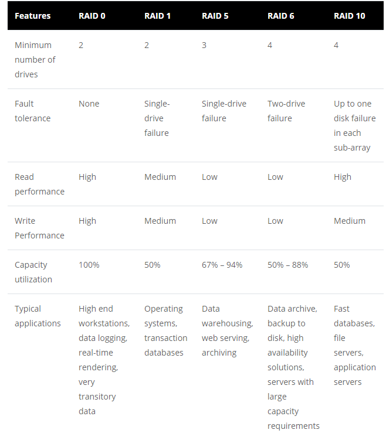
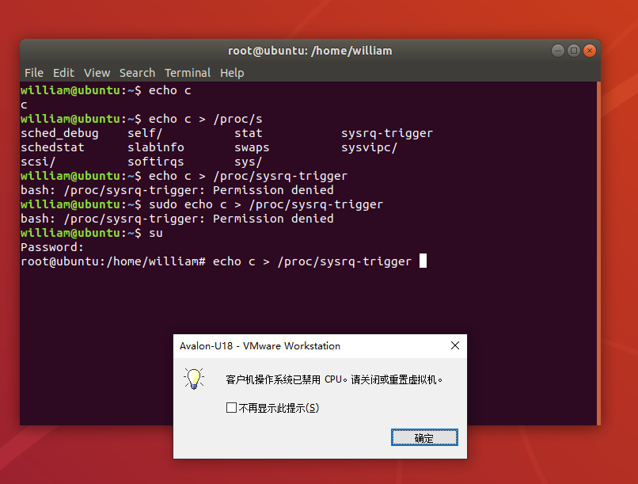
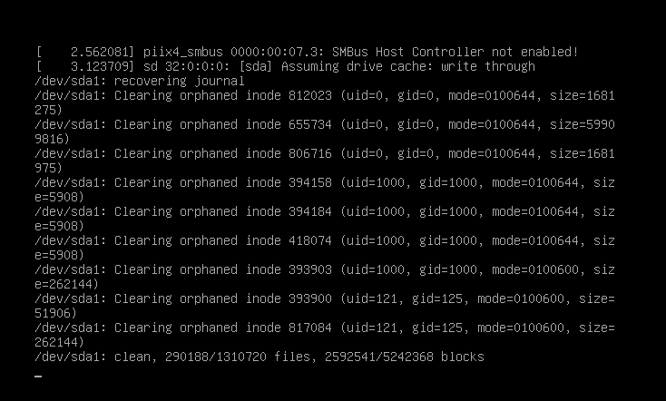

# VE482 Homework 8

<center><div style="width:100%;height:57%;text-align:center;font-size:16px;line-height:25px;font-family: 'Courier New', Courier, monospace;font-weight:300;"><b>Due: Dec.6<br>Name: Wu Qinhang<br>ID: 518370910041<br>Email: william_wu@sjtu.edu.cn</b>
</div></center>


## Ex1 Input/Output

**1. Is it possible to scan a document and send it through a wireless network at full speed? Explain why, why not.**

- If the job of calculation and I/O are separated completely, it can. However in the real case, scanning the document involves calculating the buffer and so on, so that the process in charge of the wireless network cannot send out the data at full speed.

**2. How can an OS facilitate the installation of a new device without any need to recompile the OS or even to reboot it?**

- by using loadable driver, so that the new device can be loaded dynamically, and the system don't need to be recompiled.

**3. I/O:**

a) Device Independent OS Software

b) Device Drivers

c) Interrupt Handlers

d) User Level I/O Software

**4. A DMA controller has four channels. The controller is able to request a 32bit word every 100 nsec. A respond takes equally long. How fast should the bus be in order to avoid being a bottleneck?**

- $2\times10^7Byte/second$

**5. Briefly explain what a thin client is.**

- A thin client is a computer that runs based on the resources that is stored on a central server. Usually it has low performance. It is optimized for remote connection.

**6. Describe how a hard disk is working and give a few details regarding its geometry.**

- A hard disk consists of several platters where the data is stored. there are several paths on the surface of the head of the disk, and it is shaped as a cylinder.

**7. What are differences between RAID 0, 1, 5, 6, and 10?**

- RAID 0: data are split up into blocks. They get can written across all drives so that the read and write speed is fast.
- RAID 1: a setup of at least two drives, one as a backup.
- RAID 5: a setup of at least three drives that involve a parity mechanism across the drives. The write speed is slower for the parity to be calculated. 
- RAID 6: the parity data are written into two drives, so that at least four drives are required.
- RAID 10: at least four drives that provide secure data manipulation.



<center>RAID Level Comparison, cited from [7]</center>

## Ex2 Multiprocessors

**Suppose that the TSL instruction was not available for synchronizing a multiprocessor. Instead, another instruction, SWP was provided that atomically swapped the contents of a register with a word in memory. How could that be used to provide multiprocessor synchronization?**

- first load 1 into the register, then swap register with memory, so that the memory has value 1, indicating the data is locked. That can be utilized to provide multiprocessor synchronization.

**Briefly describe virtualization and the main challenges that need to be overcome.**

- virtualization is about using software to emulate functionality of hardware. The major challenges needed to be overcome: the reasonable distribution of resources, the monitor of performance, backup of data, and security issues.

## Ex3 File Systems

**Assuming the current working directory is /usr/share/doc/mutt/examples what is the absolute path of ../../../doc/../../lib/mutt?**

- `/usr/lib/mutt`

**A Unix system has 1KB blocks and 4B disk addresses. What is the maximum file size if i-nodes contain 13 direct entries, and one single, double, and triple indirect entry each?**

- $13+256+256*256+256*256*256\approx16843021KB$

**The time required to read a certain number of bytes can be approximated by summing the seek, rotation delay, and transfer times. Given a disk with mean seek time of 8 msec, a rotation rate of 15,000 rpm and 262,144 bytes per track what are the data rates for block sizes of (i) 1 KB, (ii) 2 KB, and (iii) 4 KB?**

- $DataTransferRate=AmountofData/TransferTime$
- ~~rotation delay: 1/(15000/60)*1000=4msec~~ From standard data we know that 15000 rpm -> 2.00ms rotational latency
- transfer time: 
- (i) $8+2+(1\times1024/2262144)*1000=12.453$
- (ii) $8+2+(2\times1024/2262144)*1000=12.905$
- (iii) $8+2+(4\times1024/2262144)*1000=13.811$
- If the amount of data is given, we can calculate the data rate. Unfortunately it is not, so that I can only give the transfer time.

## Ex4 Security

**If using only lowercase letters how many possible 8 letter words can be chosen? Explain why a password should always contain lower and uppercase letters, numbers and symbols.**

- 208,827,064,576 possible words. If the password contains lower and uppercase letters, numbers and symbols, it will take much more time for the attacker to crack it, since the combinations are far larger than this.

**Explain why memory dynamically allocated using malloc is sometimes random and some other times set to 0.**

- The reason why allocated pages using malloc are zeroed is about security enhancement since it can prevent data leak from one process to another. [^1]

**A computer system is made of several components each featuring a different level of security. How secure is this system?**

- Very probably not very secure. It may be hacked through the weakest part, and the whole system is down.

**Can security be achieved? Explain your answer.**

- Every system has flaws that can be exploited to attack the system eventually, and it requires much more resources to reinforce the security. For a developing business system, a sustainable security cannot be achieved unless taking the tradeoff of huge maintenance resources.

## Ex5 Firewalls [^2][^3][^4][^5]

Linux firewall acts as a security system that filters the data flow between network space and the system. It consists a series of rules that test the data in many aspects to see whether it is allowed to get through. Many tools are available, such as IPTables, firewalld, nftables, ebtables, arptables, and so on. 

==IPTables== is a default tool provided by Linux that controls IPv4 and IPv6 filtering rules on linux machine. It generally has three manipulative actions on the transmitted data: accepting the traffic, blocking the traffic, and sending back a reject message to the sender. It supports a set of command line options which allow linux user to easily setup the firewall. It maintains three chains: INPUT, FORWARD, and OUTPUT. INPUT controls the rule of manipulating the incoming connections, such as SSH remote access connection. FORWARD manipulates the incoming connections that have not been delivered locally yet. OUTPUT manipulates outgoing connections before the connection attempt. The rules can be grep from command `sudo iptables -L`.

==ebtables== is another filtering tool for linux that enables the transparent filtering of traffic. It can be combined together with other tools like iptables and arptables to make a bridging firewall for linux that is able to filter higher network layers. It includes features like ethernet filtering, MAC Ethernet source and destination address alternation, deciding which traffic to bridge between two interfaces and which one to route between the same two interfaces. It can also pass packets to userspace programs by using netlink sockets.

==arptables== is another tool that maintains the Address Resolution Protocol packet filter rules in linux. It can be used to create, update, view the tables that contain the filtering rules. A specified rule contains criteria for a packet and a target. 

## Ex6 Kernel panic

Kernel panic refers to a operating system error that cannot be recovered easily or will probably result in major data loss. 

For example, `sysrq-trigger` is used to send instructions to the kernel. By sending 

```shell
echo c > /proc/sysrq-trigger
```

a kernel panic will be triggered[^6].



<center>"CPU was banned, please shutdown or reset the virtual machine."</center>



<center>system recover</center>

## Ex7 Survey

The survey has been completed:


<center>Survey Proof</center>

## Reference

[^1]: Re: malloc,” *Mail-archive.com*, 2020. https://www.mail-archive.com/freebsd-hackers@freebsd.org/msg37534.html (accessed Dec. 06, 2020).

[^2]: “How to setup firewall in Linux? - GeeksforGeeks,” *GeeksforGeeks*, Aug. 09, 2018. https://www.geeksforgeeks.org/how-to-setup-firewall-in-linux/ (accessed Dec. 06, 2020).
[^3]: “Linux firewalls: What you need to know about iptables and firewalld,” *Opensource.com*, 2018. https://opensource.com/article/18/9/linux-iptables-firewalld (accessed Dec. 06, 2020).
[^4]: Korbin Brown, “The Beginner’s Guide to iptables, the Linux Firewall,” *How-To Geek*, Feb. 06, 2014. https://www.howtogeek.com/177621/the-beginners-guide-to-iptables-the-linux-firewall/ (accessed Dec. 06, 2020).
[^5]: “ebtables – Main features,” *Netfilter.org*, 2020. https://ebtables.netfilter.org/documentation/features.html (accessed Dec. 06, 2020).
[^6]: “Use /proc/sysrq-trigger in linux,” *PhuocTai Huynh*, Dec. 05, 2019. https://phuoctaihuynh.wordpress.com/2019/12/05/use-proc-sysrq-trigger-in-linux/ (accessed Dec. 06, 2020).
[^7]: “RAID Level Comparison: RAID 0, RAID 1, RAID 5, RAID 6 and RAID 10 | Dataplugs,” *Dataplugs*, Aug. 21, 2018. https://www.dataplugs.com/en/raid-level-comparison-raid-0-raid-1-raid-5-raid-6-raid-10/ (accessed Dec. 06, 2020).