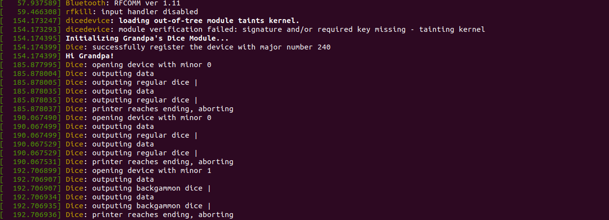
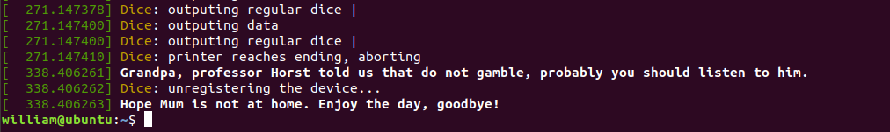

<div style="width:60%;height:200px;text-align:center;border:14px solid #808080;border-top:none;border-left:none;border-bottom:none;display:inline-block">
    <div style="border:4px solid #808080;border-radius:8px;width:95%;height:100%;background-color: rgb(209, 209, 209);">
        <div style="width:100%;height:30%;text-align:center;line-height:60px;font-size:26px;font-family:'Lucida Sans', 'Lucida Sans Regular', 'Lucida Grande', 'Lucida Sans Unicode', Geneva, Verdana, sans-serif;">VE482 Lab Report</div>
        <div style="width:100%;height:10%;text-align:center;line-height:26px;font-size:20px;font-familny:'Lucida Sans', 'Lucida Sans Regular', 'Lucida Grande', 'Lucida Sans Unicode', Geneva, Verdana, sans-serif;"><b>Lab 9</b> - Fall 2020</div>
        <div style="width:100%;height:57%;text-align:center;font-size:16px;line-height:22px;font-family: 'Courier New', Courier, monospace;font-weight:300;"><br><b>Yuchen Ai<br>Tim Shi<br>Qinhang Wu<br>Zhimin Sun<br></b></div>
    </div>
</div>
<div style="width:35%;height:200px;display:inline-block;float:right">
    <div style="width:100%;height:25%;text-align:center;line-height:55px;font-size:20px;font-family:'Lucida Sans', 'Lucida Sans Regular', 'Lucida Grande', 'Lucida Sans Unicode', Geneva, Verdana, sans-serif;"><b>Table of Contents</b></div>
    <div style="width:100%;height:75%;text-align:left;margin-left:2px;line-height:30px;font-size:13px;font-family:Verdana, Geneva, Tahoma, sans-serif;font-weight:300;">• Linux Kernel Module<br>• Linux Device<br>• user space / kernel space communication<br></div>
</div>

[TOC]

## Kernel Device

**What needs to be returned by read and write file operations for a character device?**

- Read: if error, -1; if success the number of bytes read.
- Write: if error, -1; if success, the number of bytes written.

**How are exactly those major and minor numbers working? You vaguely remember that you can display them using ls -l /dev.**

- Major number: a `unsigned int` (0–255) that identifies the driver associated with the device. It is the same when driven by the same driver.
- Minor number: a `unsigned int` that is used by kernel to determine exactly which device is being referred to. It is unique for devices with the same driver. In this example, ==dice== is registered with one major number and three minor numbers, each minor number representing one type of dice.

**Knowing the major number and minor numbers of a device, how to add a character device to /dev?**

```shell
# (Create a new device directly)
mknod /dev/$device_name c $major_id $minor_id

# (add a character device to /dev)
cdev_add(struct cdev *dev, dev_t num, unsigned int count);
```

**Where are the following terms located in linux source code?**

- module_init       include/linux/module.h

- module_exit       include/linux/module.h

- printk         include/linux/printk.h

- container_of      include/linux/kernel.h

- dev_t         include/linux/types.h

- MAJOR         include/linux/kdev_t.h

- MINOR         include/linux/kdev_t.h

- MKDEV         include/linux/kdev_t.h

- alloc_chrdev_region   fs/char_dev.c

- module_param      include/linux/moduleparam.h

- cdev_init        fs/char_dev.c

- cdev_add          fs/char_dev.c

- cdev_del          fs/char_dev.c

- THIS_MODULE       include/linux/export.h

**How to generate random numbers when working inside the Linux kernel? You think that a while back you read something about getting the current time.**

 ```c
#include <sys/random.h>
ssize_t getrandom(void *buf, size_t buflen, unsigned int flags);
 ```

**How to define and specify module options?**

By using ioctl function.

```c
static long my_ioctl (struct file *file, unsigned int cmd, unsigned long arg);
```

List options:

modinfo -p XXXXX

## Implementation of ==dice==

For source code, see attached files.

modified Makefile:

```makefile
obj-m := dicedevice.o
dicedevice-objs := dice.o

all: ko

ko:
	make -C /lib/modules/$(shell uname -r)/build M=$(PWD) modules

clean:
	make -C /lib/modules/$(shell uname -r)/build M=$(PWD) clean

transf:
	scp -rv ./dice william@192.168.1.111:/home/william/code/ve482-l9/dice

load:
	insmod ./dicedevice.ko
	cat /proc/modules | grep "dicedevice"
	cat /proc/devices | grep "Dice"

reg240:
	mknod /dev/dice0 c 240 0
	mknod /dev/dice1 c 240 1
	mknod /dev/dice2 c 240 2

rmdev:
	rm -f /dev/dice0
	rm -f /dev/dice1
	rm -f /dev/dice2
	rmmod dicedevice.ko
```

*Note: you're recommended to `su` before testing the device.*

Snapshots:






## Reference

https://stackoverflow.com/questions/15832301/understanding-container-of-macro-in-the-linux-kernel

https://www.oreilly.com/library/view/linux-device-drivers/0596005903/ch03.html

https://github.com/starpos/scull

https://www.apriorit.com/dev-blog/195-simple-driver-for-linux-os

https://github.com/apriorit/SimpleLinuxDriver

https://stackoverflow.com/questions/22487722/what-is-the-opposite-of-mknod

https://stackoverflow.com/questions/24018235/in-linux-device-driver-function-how-to-know-the-minor-number-or-for-which-parti

https://stackoverflow.com/questions/16363083/writing-permessions-for-linux-kernel-module-paramater

https://stackoverflow.com/questions/6139493/how-convert-a-char-string-to-int-in-the-linux-kernel

https://en.wikipedia.org/wiki/Backgammon

https://elixir.bootlin.com/linux/latest/source

https://www.kernel.org/doc/htmldocs/kernel-api/API-snprintf.html

https://www.kernel.org/doc/html/v4.13/core-api/kernel-api.html